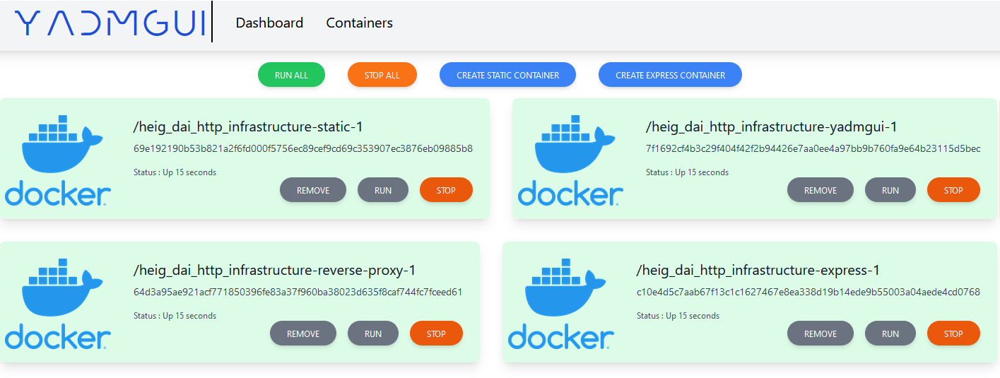

# HEIG_DAI_HTTP_Infrastructure

Authors: Jarod Streckeisen, TImothée Van Hove

## Getting started

This project aims to launch multiple instances of web servers using a reverse proxy with a load balancer using the web interface (or the good old command line interface).

### Install Docker

Firstly, you must install Docker on your local machine (see the [Docker documentation](https://www.docker.com/get-started/)).

Then clone this repo, open your terminal in the project directory and run :

```
docker-compose up -d --build
```

### Run containers

You can either run container individually from the terminal or by using the web interface.

#### From the terminal

In the `docker-compose.yml` file, you can change the configuration and define the number of static /  dynamic server instances you want to run by changing the "replicas"parameters:

```dockerfile
static:
    build: ./Static server
    deploy:
      replicas: 5

  express:
    build: ./Express server
    deploy:
      replicas: 3
```

#### From the user interface

From your web browser, go to [manage.localhost](manage.localhost). From there you can start, stop and delete docker containers. Note that the web application retrieve all your local docker containers. So you will be able to delete existing docker containers (even those non related to this project), so be careful!

**Warning!** It is also possible to stop the reverse proxy and web application containers (from the web application), in which case, either the web application or the static/dynamic servers won't be reachable anymore. To fix that, you must stop all running container and up again the `docker-compose.yml`.

## Project description

### Overview

The infrastructure is composed of:

- Multiple static web server instances
- Multiple Dynamic web server instances
- A reverse proxy that manages load balancing and sticky sessions
- A web application that manages the running containers

### Docker configuration

This is the `docker-compose.yml` configuration.

##### Reverse proxy and load balancer

Firstly, this project uses the [traefik](https://doc.traefik.io/traefik/providers/docker/) image from [dockerhub](https://hub.docker.com/_/traefik/).

In order to configure the reverse proxy & load balancer, you will need configure it as follow:

```dockerfile
  reverse-proxy:
    # The official v2 Traefik docker image
    image: traefik:v2.9
    # Enables the web UI and tells Traefik to listen to docker
    command: 
    - --api.insecure=true 
    - --providers.docker
    - --entrypoints.web.address=:80
    ports:
      # The HTTP port
      - "80:80"
      # The Web UI (enabled by --api.insecure=true)
      - "8080:8080"
    volumes:
      # So that Traefik can listen to the Docker events
      - /var/run/docker.sock:/var/run/docker.sock
```

##### Static server configuration

The static server is configured to enable sticky sessions (see the [traefik documentation](https://doc.traefik.io/traefik/routing/services/#sticky-sessions)). This server is accessible by default at [localhost](localhost).

```dockerfile
  static:
    build: ./Static server
    deploy:
      replicas: 1
    labels: 
      - "traefik.enable=true"
      - "traefik.http.routers.static.rule=Host(`localhost`)"
      # Enabling the sticky sessions with cookies
      - "traefik.http.services.static.loadbalancer.sticky.cookie=true"
      - "traefik.http.services.static.loadbalancer.sticky.cookie.name=stickyCookie"
```

##### Dynamic server configuration

The Dynamic server is accessible by default at [localhost/api](localhost/api). The reverse proxy will route all requests from this address directly to the dynamic server. The load balancer will perform a round robin on each connexion to balance the traffic on each individual dynamic server.

```dockerfile
  express:
    build: ./Express server
    deploy:
      replicas: 1
    labels: 
      - "traefik.enable=true"
      - "traefik.http.routers.express.rule=Host(`localhost`)"
      - "traefik.http.services.express.loadbalancer.server.port=3000"
      - "traefik.http.routers.express.rule=PathPrefix(`/api`)"
      #Strip the /api to make the request call the "/" route of our dynamic server
      - "traefik.http.middlewares.express-strip.stripprefix.prefixes=/api"
      #Link the stripping middleware to the router
      - "traefik.http.routers.express.middlewares=express-strip"
```


##### Web interface configuration

The web interface in reachable by default at [manage.localhost](manage.localhost). No Sticky session is configured for it, as it is only aimed to be used by the local system administrator to maintain the infrastructure.

```dockerfile
  yadmgui:
    build: ./yadmgui
    labels:
      - "traefik.http.routers.yadmgui.rule=Host(`manage.localhost`)"
      - "traefik.http.services.yadmgui.loadbalancer.server.port=5000"
      - "traefik.http.routers.yadmgui.entrypoints=web"  
    volumes:
        - /var/run/docker.sock:/var/run/docker.sock
```

### Static server

To create the static server, we simply used a free template from [here](https://www.free-css.com/free-css-templates/page285/meyawo), and changed few text in it.

This server keeps track of the user sessions with a sticky session mechanism. The server itself doesn't uses cookies, it is the reverse proxy that manages it and redirects automatically each session to the same static server. By deleting the line `- "traefik.http.services.static.loadbalancer.sticky.cookie=true"` in the `docker-compose.yml` file, each session will be served by a different static server at each connexion because of the load-balancing mechanism.

### Dynamic server


The dynamic server shows funny Chuck Norris jokes and displays a gif image. Every 5 seconds the joke and the gif is changed.

To get the jokes, we used the https://api.chucknorris.io/ API

To get the gif images, we used the [giphy API](https://developers.giphy.com/docs/api/).

To serve dynamic content, we used express and ejs. In the javaScript server, are managed all the api calls. We embedded a js script directly in the HTML code to perform a fetch on the sever (localhost/fetch) every 5 seconds. When the server receives the request, it will update the ejs variables in the HTML page.

### Reverse Proxy

### Management web app




The web app has been done from the ground up by Jarod Streckeisen as a technical challenge. It allows a user to run/stop/start/delete existing containers. The app can run either on the host machine or inside a Docker container.

#### How to run 

By default, an instance of YADMGUI is started within our infrastructure in a Docker container, however if you want to run it on your machine, follow theses steps :

go inside the YADMGUI directory, install the dependencies with the following command.

``` 
npm install
```
after the installation ended you can run the application 

```
npm run start
```
it can then be accessed on any web browser at http://localhost:5000 (5000 being the default port and can be changed)

#### Technologies and Libraries

We used Node.js, Express, and EJS for our web application. Node.js is a JavaScript runtime that allows us to run JavaScript on the server side. Express is a web framework for Node.js that makes it easy to handle routing and middleware. EJS is a template engine that allows us to embed JavaScript code in our HTML, making it easy to generate dynamic HTML on the server side.

We used the [Dockerode](https://www.npmjs.com/package/dockerode) library to communicate with the Docker API in our web application. Dockerode is a Node.js library that provides an easy-to-use interface for interacting with the Docker API. 

We also used [docker-compose](https://github.com/PDMLab/docker-compose) library in attempt to create new instance of our static and dynamic servers.

#### Features

 - List all containers and display somes informations about them, including their name, their id and their status
 - Run a stopped containers
 - Stop a running containers
 - Delete a stopped containers
 - Run all containers
 - Stop all containers
 - (Add an instance of our static server)
 - (Add an instance of our dynamic server)

#### Caveats 

**Adding an instance doesn't work if the app is inside a Docker container**

For some reason, when we run our infrastructure and then try to add a new instance of our static or dynamic server. traefik doesn't recognize the new container. So our only way to properly scale them is to use the **--scale \[SERVICE]=\[NUMBER]** argument in the **docker-compose up** command. 

To use the docker-compose library, both docker-compose and Docker must be installed on the host machine. However, if the app is running in a container with Docker installed, at this time i had no idea how to tell docker-compose to use the host machine docker API.

After further research, one solution is to use the -H or --host flag when running docker-compose commands, which allows you to specify the host's Docker daemon. We could also use the Docker contexts system to tell Docker inside the container to use the host machine docker engine.
